# Auto Pausing Inactive Clusters
## Introduction

A couple of years ago I wrote an [article](https://www.mongodb.com/blog/post/atlas-cluster-automation-using-scheduled-triggers) on how to pause and/or scale clusters using scheduled triggers. It’s worth familiarizing yourself with those concepts because it will not repeat them here. Rather, I’m adding a wrinkle that will pause clusters across an entire organization based on inactivity. Specifically, I’m looking at the [Database Access History](https://docs.atlas.mongodb.com/access-tracking/) to determine activity.

It is important to note this logging limitation: \

_If a cluster experiences an activity spike and generates an extremely large quantity of log messages, Atlas may stop collecting and storing new logs for a period of time._

Therefore, this script could get a false positive that a cluster is inactive when indeed quite the opposite is happening. Given, however, that the intent of this script is for managing lower, non-production environments, I don’t see the false positives as a big concern.

## Architecture

The implementation uses a [Scheduled Trigger](https://docs.mongodb.com/realm/triggers/scheduled-triggers/). The trigger calls a series of [Realm Functions](https://docs.mongodb.com/realm/functions/), which uses the [Atlas Administration APIs](https://docs.atlas.mongodb.com/reference/api-resources/) to  iterate over the organization’s projects and their associated clusters, testing the cluster inactivity (as explained in the introduction) and finally pausing the cluster if it is indeed inactive.

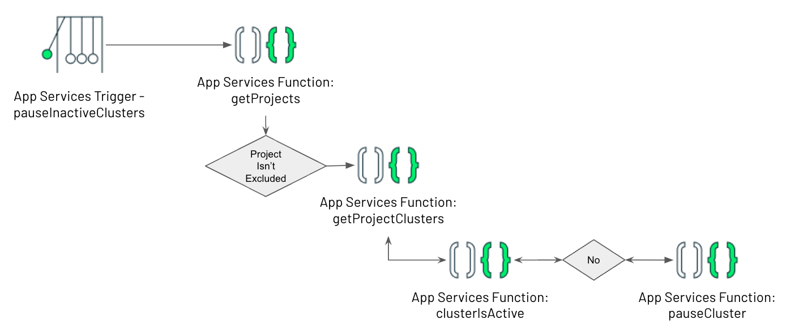

## API Keys
In order to call the Atlas Adminsitrative APIs, you'll first need an API Key with the [Organization Owner](https://docs.atlas.mongodb.com/reference/user-roles/#mongodb-authrole-Organization-Owner) role. API Keys are created in the Access Manager, which you'll find in the Organizaiton menu on the left:

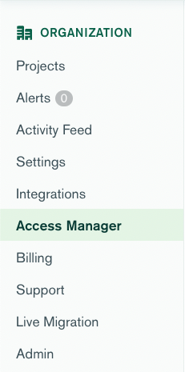

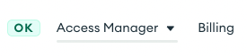

Click **Create API Key**. Give the key a description and be sure to set the permissions to **Organization Owner**:

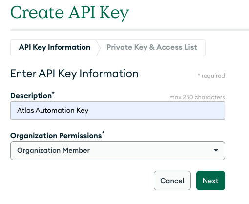

When you click **Next** you'll be presented with your Public and Private keys. **Save your private key as Atlas will never show it to you again**. 

As an extra layer of security, you also have the option to set an IP Access List for these keys. I'm skipping this step, so my key will work from anywhere.

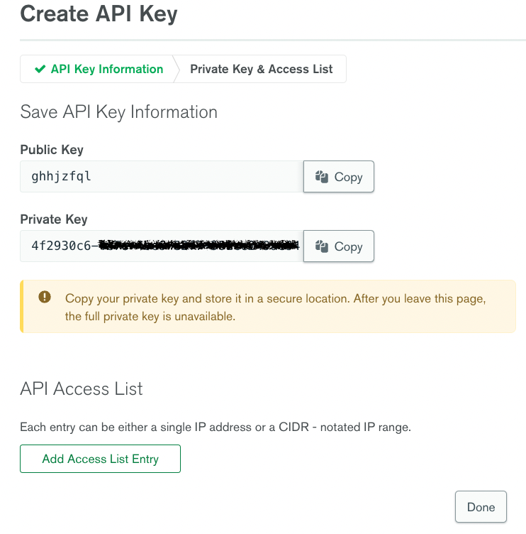
## Deployment
You can simply import the Realm application and adjust any of the functions to fit your needs...


## Build it Yourself
To understand what's included in the application, here are the steps to build it yourself from scratch. 

### Step 1: Create a Realm Application
[Realm](https://www.mongodb.com/realm/appdev) provides a powerful application development backend as a service. To begin using it, just click the Realm tab.


 You'll see that Realm offers a bunch of templates to get you started. For this use case, just select the first option to   **Build your own App**:

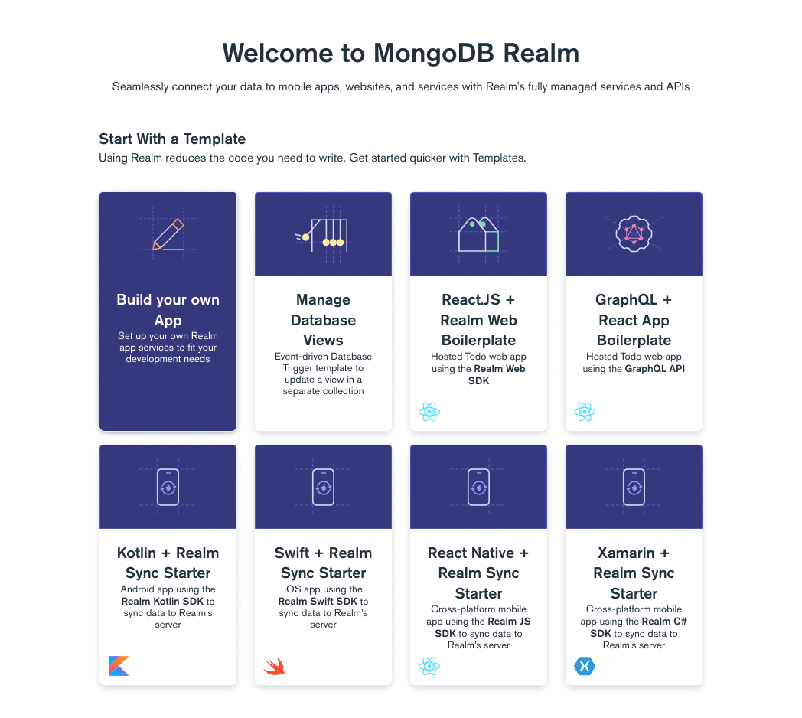

You'll then be presented with options to link a data source, name your application and choose a deployment model. The current iteration of this utility doesn't use a data source, so you can ignore that step (Realm with create a free cluster for you). You can also leave the [deployment model](https://docs.mongodb.com/realm/manage-apps/deploy/deployment-models-and-regions/) at its default (global), unless you want to limit the application to a specific region. 

I've named the application **Atlas Cluster Automation**: 

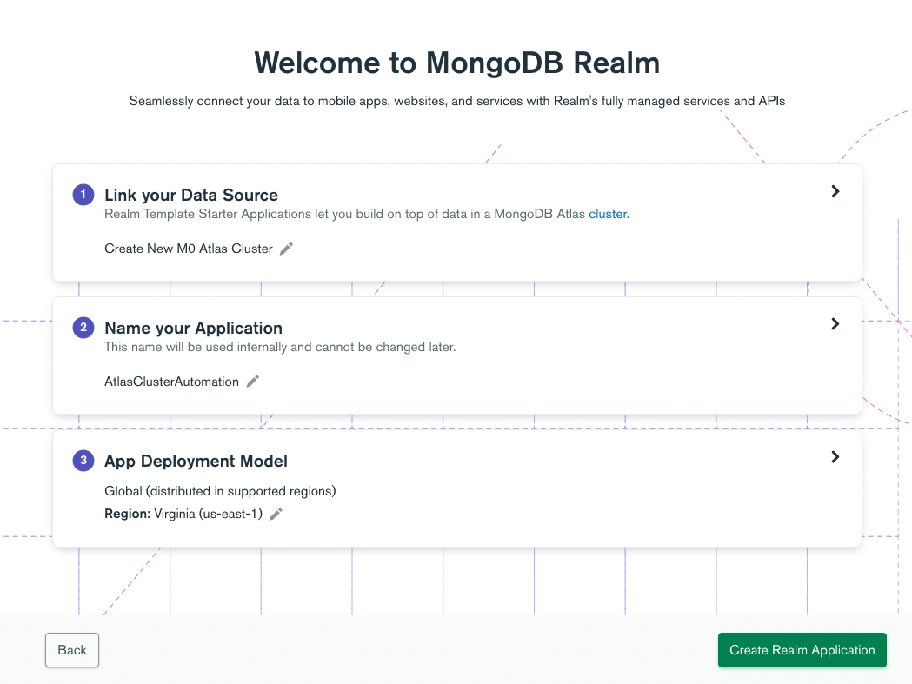

### Step 2: Store the API Key

The functions we need to create will call the [Atlas APIs](https://docs.atlas.mongodb.com/api/), so we need to store our API Public and Private Keys, which we will do using [Values & Secrets](https://docs.mongodb.com/realm/values-and-secrets/). The sample code I provide references these values as `AtlasPublicKey` and `AtlasPrivateKey`, so use those same names unless you want to change the code where they’re referenced.

You'll find `Values` unnder the Build menu:

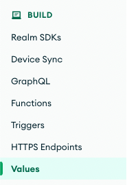

First, create a Value for your public key (note, the key is in quotes): 

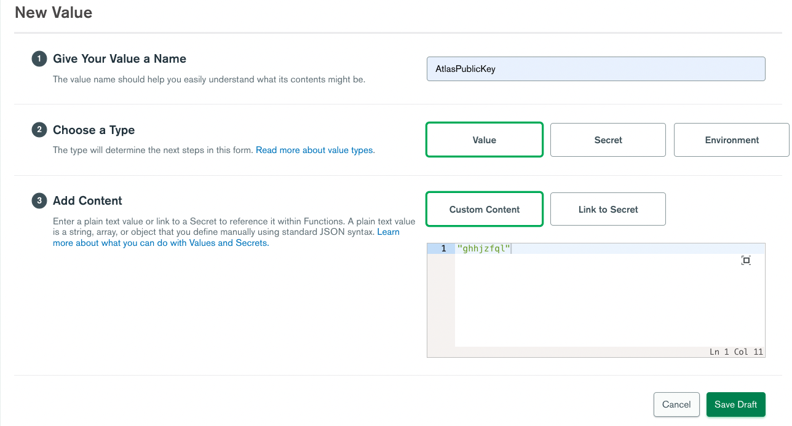

Create a Secret containing your private key (the secret is not in quotes): 

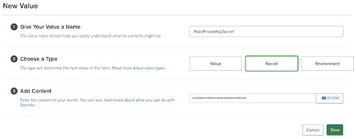

The Secret cannot be accessed directly, so create a second Value that links to the secret:  

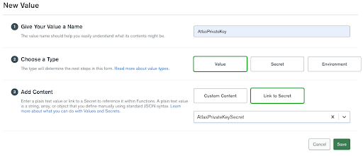
### Step 3: Create the Functions

The four functions that need to be created are pretty self-explanatory, so I’m not going to provide a bunch of additional explanations here. 
#### getProjects

This standalone function can be test run from the Realm console to see the list of all the projects in your organization. 

```Javascript
/*
 * Returns an array of the projects in the organization
 * See https://docs.atlas.mongodb.com/reference/api/clusters-modify-one/
 *
 * Returns an array of objects, e.g.
 *
 * {
 * "clusterCount": {
 *      "$numberInt": "1"
 *    },
 *    "created": "2021-05-11T18:24:48Z",
 *    "id": "609acbef1b76b53fcd37c8e1",
 *    "links": [
 *      {
 *        "href": "https://cloud.mongodb.com/api/atlas/v1.0/groups/609acbef1b76b53fcd37c8e1",
 *        "rel": "self"
 *      }
 *    ],
 *    "name": "mg-training-sample",
 *    "orgId": "5b4e2d803b34b965050f1835"
 *  }
  *
 */
exports = async function() {
  
  // Get stored credentials...
  const username = await context.values.get("AtlasPublicKey");
  const password = await context.values.get("AtlasPrivateKey");
  
  const arg = { 
    scheme: 'https', 
    host: 'cloud.mongodb.com', 
    path: 'api/atlas/v1.0/groups', 
    username: username, 
    password: password,
    headers: {'Content-Type': ['application/json'], 'Accept-Encoding': ['bzip, deflate']}, 
    digestAuth:true,
  };
  
  // The response body is a BSON.Binary object. Parse it and return.
  response = await context.http.get(arg);

  return EJSON.parse(response.body.text()).results; 
};

```
#### getProjectClusters

After `getProjects` is called, the trigger iterates over the results, passing the `projectId` to this `getProjectClusters` function. 

_To test this function, you need to supply a `projectId`. By default, the Console supplies ‘Hello world!’, so I test for that input and provide some default values for easy testing._

```Javascript
/*
 * Returns an array of the clusters for the supplied project ID.
 * See https://docs.atlas.mongodb.com/reference/api/clusters-get-all/
 *
 * Returns an array of objects. See the API documentation for details.
 * 
 */
exports = async function(project_id) {
  
  if (project_id == "Hello world!") { // Easy testing from the console
    project_id = "5e8f8268d896f55ac04969a1"
  }
  
  // Get stored credentials...
  const username = await context.values.get("AtlasPublicKey");
  const password = await context.values.get("AtlasPrivateKey");
  
  const arg = { 
    scheme: 'https', 
    host: 'cloud.mongodb.com', 
    path: `api/atlas/v1.0/groups/${project_id}/clusters`, 
    username: username, 
    password: password,
    headers: {'Content-Type': ['application/json'], 'Accept-Encoding': ['bzip, deflate']}, 
    digestAuth:true,
  };
  
  // The response body is a BSON.Binary object. Parse it and return.
  response = await context.http.get(arg);

  return EJSON.parse(response.body.text()).results; 
};

```

#### clusterIsActive

This function contains the logic that determines if the cluster can be paused. 

Most of the work in this function is manipulating the timestamp in the database access log so it can be compared to the current time and lookback window. 

In addition to returning true (active) or false (inactive), the function logs it’s findings, for example: \
 \
`Checking if cluster 'SA-SHARED-DEMO' has been active in the last 60 minutes`


```ZSH
   Wed Nov 03 2021 19:52:31 GMT+0000 (UTC) - job is being run
   Wed Nov 03 2021 18:52:31 GMT+0000 (UTC) - cluster inactivity before this time will be reported inactive
   Wed Nov 03 2021 19:48:45 GMT+0000 (UTC) - last logged database access
Cluster is Active: Username 'brian' was active in cluster 'SA-SHARED-DEMO' 4 minutes ago.
```


Like `getClusterProjects`, there’s a block you can use to provide some test project ID and cluster names for easy testing from the Realm console.

```Javascript
/*
 * Used the database access history to determine if the cluster is in active use.
 * See https://docs.atlas.mongodb.com/reference/api/access-tracking-get-database-history-clustername/
 * 
 * Returns true (active) or false (inactive)
 * 
 */
exports = async function(project_id, clusterName, minutes) {
  
  if (project_id == 'Hello world!') { // We're testing from the console
    project_id = "5e8f8268d896f55ac04969a1";
    clusterName = "SA-SHARED-DEMO";
    minutes = 60;
  } /*else {
    console.log (`project_id: ${project_id}, clusterName: ${clusterName}, minutes: ${minutes}`)
  }*/
  
  // Get stored credentials...
  const username = await context.values.get("AtlasPublicKey");
  const password = await context.values.get("AtlasPrivateKey");
  
  const arg = { 
    scheme: 'https', 
    host: 'cloud.mongodb.com', 
    path: `api/atlas/v1.0/groups/${project_id}/dbAccessHistory/clusters/${clusterName}`, 
    //query: {'authResult': "true"},
    username: username, 
    password: password,
    headers: {'Content-Type': ['application/json'], 'Accept-Encoding': ['bzip, deflate']}, 
    digestAuth:true,
  };
  
  // The response body is a BSON.Binary object. Parse it and return.
  response = await context.http.get(arg);
  
  accessLogs = EJSON.parse(response.body.text()).accessLogs; 

  now = Date.now();
  const MS_PER_MINUTE = 60000;
  var durationInMinutes = (minutes < 30, 30, minutes);   // The log granularity is 30 minutes.
  var idleStartTime = now - (durationInMinutes * MS_PER_MINUTE);
  
  nowString = new Date(now).toString();
  idleStartTimeString = new Date(idleStartTime).toString();
  console.log(`Checking if cluster '${clusterName}' has been active in the last ${durationInMinutes} minutes`)
  console.log(`   ${nowString} - job is being run`);
  console.log(`   ${idleStartTimeString} - cluster inactivity before this time will be reported inactive`);
  
  clusterIsActive = false;
  
  accessLogs.every(log => {
    if (log.username != 'mms-automation' && log.username != 'mms-monitoring-agent') {
      
      // Convert string log date to milliseconds 
      logTime = Date.parse(log.timestamp);

      logTimeString = new Date(logTime);
      console.log(`   ${logTimeString} - last logged database access`);
      
      var elapsedTimeMins = Math.round((now - logTime)/MS_PER_MINUTE, 0);
      
      if (logTime > idleStartTime ) {
        console.log(`Cluster is Active: Username '${log.username}' was active in cluster '${clusterName}' ${elapsedTimeMins} minutes ago.`);
        clusterIsActive = true;
        return false;
      } else {
        // The first log entry is older than our inactive window
        console.log(`Cluster is Inactive: Username '${log.username}' was active in cluster '${clusterName}' ${elapsedTimeMins} minutes ago.`);
        clusterIsActive = false;
        return false;
      }
    }
    return true;

  });

  return clusterIsActive;

};


```

#### pauseCluster

Finally, if the cluster is inactive, we pass the project Id and cluster name to `pauseCluster`. This function can also resume a cluster, although that feature is not utilized for this use case.

```Javascript
/*
 * Pauses the named cluster 
 * See https://docs.atlas.mongodb.com/reference/api/clusters-modify-one/
 *
 */
exports = async function(projectID, clusterName, pause) {
  
  // Get stored credentials...
  const username = await context.values.get("AtlasPublicKey");
  const password = await context.values.get("AtlasPrivateKey");
  
  const body = {paused: pause};
  
  const arg = { 
    scheme: 'https', 
    host: 'cloud.mongodb.com', 
    path: `api/atlas/v1.0/groups/${projectID}/clusters/${clusterName}`, 
    username: username, 
    password: password,
    headers: {'Content-Type': ['application/json'], 'Accept-Encoding': ['bzip, deflate']}, 
    digestAuth:true,
    body: JSON.stringify(body)
  };
  
  // The response body is a BSON.Binary object. Parse it and return.
  response = await context.http.patch(arg);

  return EJSON.parse(response.body.text()); 
};
```

### pauseInactiveClusters

This fuction will be called by a trigger. As it's not possible 
to pass a parameter to a scheduled trigger, it uses a hard-coded lookback window of 60 minutes that you can change to meet your needs. You could even store the value in an Atlas database and build a UI to manage it’s setting :-).

The function will evaluate all projects and clusters in the organization where it’s hosted. Understanding that there are likely projects or clusters that you never want paused, the function also includes an excludeProjects array, where you can specify name of the projects to exclude from evaluation.

Finally, you’ll notice the call to pauseCluster is commented out. I suggest you run this function for a couple of days and review the Trigger logs to verify it behaves as you’d expect.

```Javascript
/*
 * Iterates over the organizations projects and clusters, 
 * pausing clusters inactive for the configured minutes.
 */
exports = async function() {
  
  minutesInactive = 60;
  
  /*
   * These project names are just an example. 
   * The same concept could be used to exclude clusters or even 
   * configure different inactivity intervals by project or cluster.
   * These configuration options could also be stored and read from 
   * and Atlas database.
   */
  excludeProjects = [PROD1, 'PROD2'];   
  
  const projects = await context.functions.execute("getProjects");
  
  projects.forEach(async project => {
    
    if (excludeProjects.includes(project.name)) {
      console.log(`Project '${project.name}' has been excluded from pause.`)
    } else {
      
      console.log(`Checking project '${project.name}'s clusters for inactivity...`);

      const clusters = await context.functions.execute("getProjectClusters", project.id);
      
      clusters.forEach(async cluster => {
        
        if (cluster.providerSettings.providerName != "TENANT") {   // It's a dedicated cluster than can be paused
        
          if (cluster.paused == false) {
        
            is_active =  await context.functions.execute("clusterIsActive", project.id, cluster.name, minutesInactive);
            
            if (!is_active) {
              console.log(`Pausing ${project.name}:${cluster.name} because it has been inactive for more then ${minutesInactive} minutes`);  
              //await context.functions.execute("pauseCluster", project.id, cluster.name, pause);
            } else {
              console.log(`Skipping pause for ${project.name}:${cluster.name} because it has active database users in the last ${minutesInactive} minutes.`);
            }
          }
        }
      });
     }
    });

  return true;
};
```

### Step 4: Create the Schedule Trigger

Yes, we’re still using a [scheduled trigger](https://docs.mongodb.com/realm/triggers/scheduled-triggers/), but this time the trigger will run periodically to check for cluster inactivity. Now, your developers working late into the night will no longer have the cluster paused underneath them. 

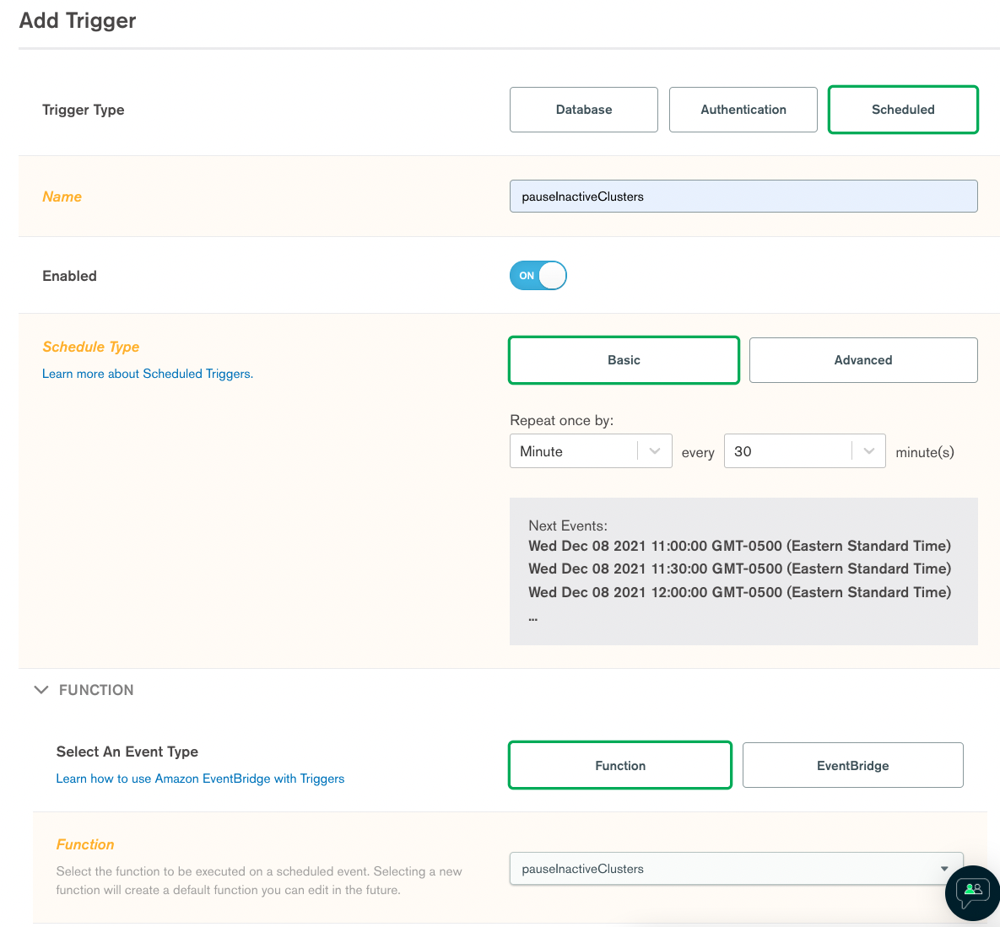

### Step 5: Deploy

As a final step you need to deploy the Realm application. 


## Summary

The genesis for this article was a customer, when presented my previous article on scheduling cluster pauses, asked if the same could be achieved based on inactivity. It’s my belief that with the Atlas APIs, anything could be achieved. The only question was what constitutes inactivity? Given the heartbeat and replication that naturally occurs, there’s always some “activity” on the cluster. Ultimately, I settled on database access as the guide. Overtime, that metriic may be combined with some additional metrics or changed to something else all together, but the bones of the process are here.
